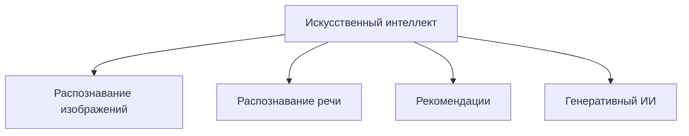

# Что такое искусственный интеллект

Искусственный интеллект, или ИИ, — это общее название для компьютерных программ, которые умеют выполнять задачи, обычно требующие человеческих навыков. Например, программа может распознать речь, найти объект на фотографии или предложить фильм по твоему вкусу.

## ИИ — не волшебство

Обычная программа действует по правилам, которые заранее записал разработчик. Система с ИИ тоже создана людьми, но часто она учится находить закономерности по большому числу примеров. Такой подход называется [машинным обучением](02_neural_network_training.md).

Представь приложение, которое отличает фотографии кошек от фотографий собак. Вместо списка правил вроде «у кошки обязательно такие уши» ему показывают много подписанных снимков. Постепенно программа замечает полезные признаки и учится давать ответ для нового изображения.

## Может ли ИИ думать как человек?

ИИ хорошо справляется с отдельными задачами, но это не означает, что он понимает мир так же, как человек. Даже очень убедительный ответ программы может быть неверным. У ИИ нет жизненного опыта, поэтому человеку важно оценивать результат.

## Какие бывают системы с ИИ?

Некоторые системы анализируют данные, а [генеративный ИИ](03_generative_ai.md) может создавать новый текст или изображение. Примеры из обычной жизни собраны в статье [«Где ИИ встречается каждый день»](04_ai_in_everyday_life.md).

## Главное

- ИИ — это технология, а не самостоятельное разумное существо.
- Результат зависит от задачи, данных и работы разработчиков.
- Ответы ИИ нужно проверять.

## Вопросы для самопроверки
1. Какие задачи может выполнять ИИ?
2. Чем обучение на примерах отличается от заранее записанного списка правил?
3. Почему нельзя считать любой ответ ИИ правильным?

---
Автор: Козлов Глеб, GitHub: @glebb228  
*Ресурсы: LLM — OpenAI Codex (GPT-5); WikiData — Q11660*
