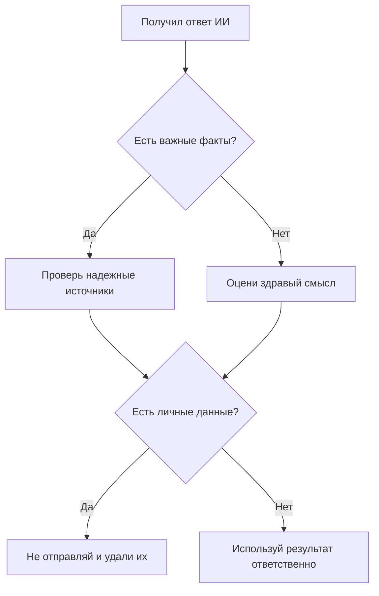

# Как пользоваться ИИ безопасно

ИИ может быть полезным помощником: объяснить тему, предложить идеи или подготовить черновик. Но программа не несет ответственность за свои ответы. Ответственность остается у человека.

## Проверяй факты

Если [генеративный ИИ](03_generative_ai.md) назвал дату, правило, цитату или ссылку, найди подтверждение в надежном источнике. Для школьного проекта подойдут учебник, официальный сайт, энциклопедия или несколько независимых публикаций.

## Не отправляй личные данные

Не вводи в чат с [ИИ](01_artificial_intelligence.md):
- пароли и коды подтверждения;
- домашний адрес и номер телефона;
- фотографии документов;
- личные сведения других людей;
- закрытые материалы школы или работы.

Даже если сервис выглядит дружелюбно, перед отправкой текста подумай, можно ли было бы показать его незнакомому человеку.

## Уважай авторов

Если ИИ помог подготовить проект, расскажи об этом честно и проверь правила задания. Не выдавай чужой текст за полностью самостоятельную работу. Не проси систему копировать стиль живого автора слишком точно.

## Помни об ошибках и предвзятости

Модель обучается на данных, а в данных могут встречаться неточности и несправедливые стереотипы. Поэтому ответ важно оценивать критически, особенно если речь идет о здоровье, деньгах, безопасности или других людях.

## Короткий чек-лист

- Я не отправляю личные данные.
- Я проверяю важные факты.
- Я понимаю, где использовал помощь [ИИ](01_artificial_intelligence.md).
- Я сам отвечаю за итоговое решение.

## Вопросы для самопроверки
1. Какие данные нельзя отправлять ИИ?
2. Где проверить важный факт?
3. Кто отвечает за решение, принятое с помощью ИИ?

---
Автор: Козлов Глеб, GitHub: @glebb228  
*Ресурсы: LLM — OpenAI Codex (GPT-5); WikiData — Q116291231*
