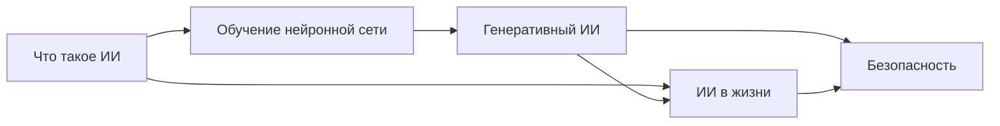

# Искусственный интеллект простыми словами

Искусственный интеллект уже встречается в телефонах, играх, поиске и учебных сервисах. Этот небольшой раздел поможет разобраться, как он работает и как пользоваться им ответственно.

## Статьи
1. [Что такое искусственный интеллект](articles/01_artificial_intelligence.md)
2. [Как обучается нейронная сеть](articles/02_neural_network_training.md)
3. [Генеративный ИИ и языковые модели](articles/03_generative_ai.md)
4. [Где ИИ встречается в повседневной жизни](articles/04_ai_in_everyday_life.md)
5. [Как пользоваться ИИ безопасно](articles/05_ai_safety.md)

## Карта раздела

