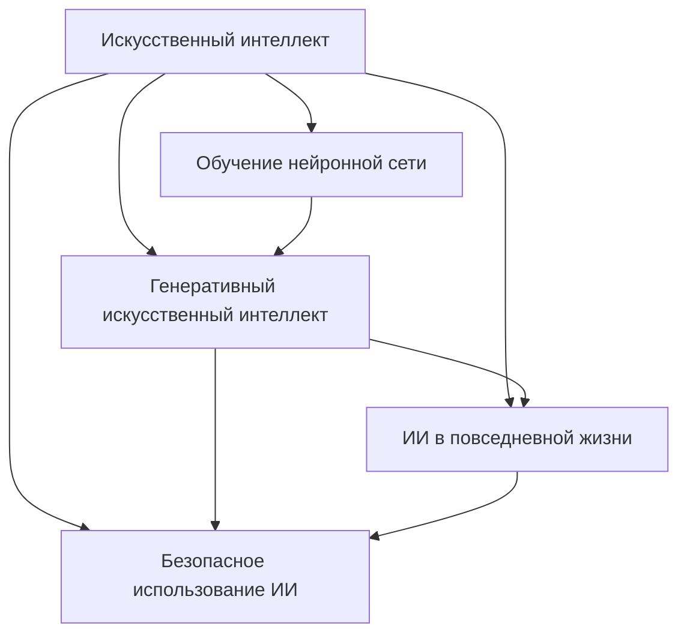

# 5.1 Технологии и цифровая грамотность
## Тема: Искусственный интеллект простыми словами

### Цель
Создать компактный раздел детской энциклопедии, который объясняет школьнику базовые идеи искусственного интеллекта, показывает его применение в жизни и учит проверять ответы нейросетей.

### Состав команды

| Участник | Роль |
|----------|------|
| Козлов Глеб, GitHub: @glebb228 | Автор, редактор, разработчик скриптов |

Работа выполнена одним участником, поэтому концептуализация включает 5 связанных понятий вместо стандартных 15 понятий для команды из 5 человек.

### Что сделано
1. Определены пять понятий и связи между ними.
2. Подготовлены пять статей для школьников.
3. Для каждого понятия указан идентификатор WikiData.
4. Добавлены SPARQL-запросы для получения структурированных знаний.
5. Добавлен шаблон генерации черновиков через LLM API.
6. Добавлен скрипт расстановки перекрестных ссылок.

## Концептуализация

### Понятия
1. Искусственный интеллект
2. Обучение нейронной сети
3. Генеративный искусственный интеллект
4. ИИ в повседневной жизни
5. Безопасное использование ИИ

### Онтология

### Горизонтальные связи
- Обучение нейронной сети помогает понять, почему результат зависит от примеров.
- Генеративный ИИ является одним из видов ИИ и создает новый контент.
- Повседневные применения показывают, где школьник уже встречается с ИИ.
- Правила безопасности связаны со всеми статьями: любой результат ИИ нужно оценивать критически.

## Источники знаний
- [WikiData: artificial intelligence](https://www.wikidata.org/wiki/Q11660)
- [WikiData: machine learning](https://www.wikidata.org/wiki/Q2539)
- [WikiData: artificial neural network](https://www.wikidata.org/wiki/Q192776)
- [WikiData: generative artificial intelligence](https://www.wikidata.org/wiki/Q117246174)
- [WikiData: AI safety](https://www.wikidata.org/wiki/Q116291231)

Запросы для WikiData сохранены в `sparql/wikidata_queries.md`.

## Автоматизация

### Генерация черновиков
Файл: `src/generate_pages_template.py`

Скрипт читает `concepts.json`, составляет промпт с требованием объяснять материал десятилетнему ребенку и обращается к совместимому с Chat Completions API. Черновики сохраняются отдельно, чтобы не перезаписывать вручную отредактированные статьи.

### Расстановка ссылок
Файл: `src/insert_links.py`

Скрипт читает `concepts.json`, проходит по статьям темы и добавляет относительные Markdown-ссылки для найденных терминов. Уже существующие ссылки и заголовки он не меняет.

### Использованные модели
- OpenAI Codex (GPT-5): подготовка структуры, генерация и редактура текстов, создание скриптов.

## Структура раздела
- `WORK/5.1_technology_and_digital_literacy/artificial_intelligence_simple/concepts.json`
- `WORK/5.1_technology_and_digital_literacy/artificial_intelligence_simple/llm_prompts.md`
- `WORK/5.1_technology_and_digital_literacy/artificial_intelligence_simple/sparql/wikidata_queries.md`
- `WORK/5.1_technology_and_digital_literacy/artificial_intelligence_simple/src/generate_pages_template.py`
- `WORK/5.1_technology_and_digital_literacy/artificial_intelligence_simple/src/insert_links.py`
- `WEB/5.1_technology_and_digital_literacy/artificial_intelligence_simple/contents.md`
- `WEB/5.1_technology_and_digital_literacy/artificial_intelligence_simple/articles/`

## Проверка
1. Тексты вручную отредактированы для детской аудитории.
2. Статьи связаны относительными ссылками.
3. `concepts.json` проверяется стандартным JSON-парсером.
4. Скрипт ссылок поддерживает режим `--dry-run`.
